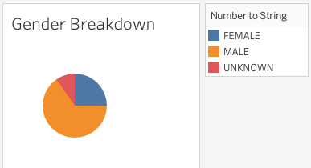
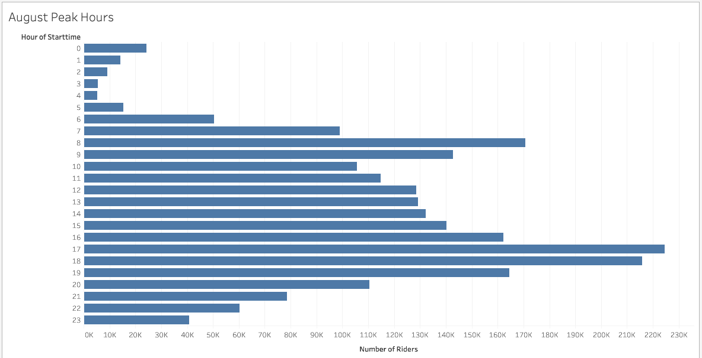
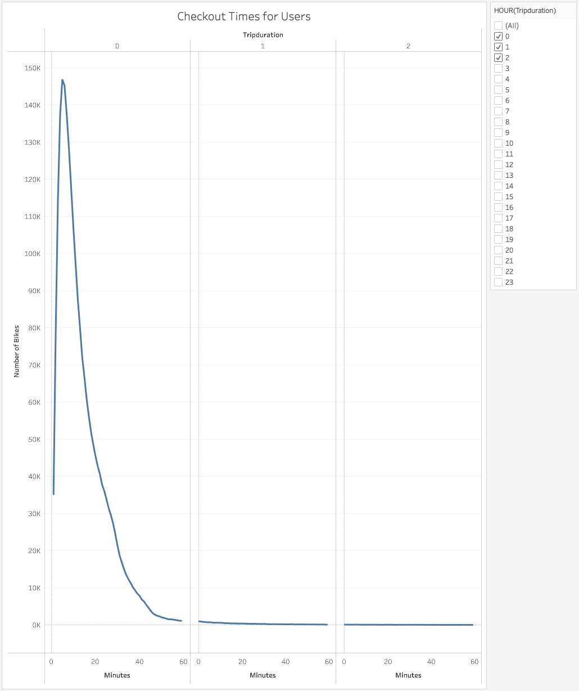
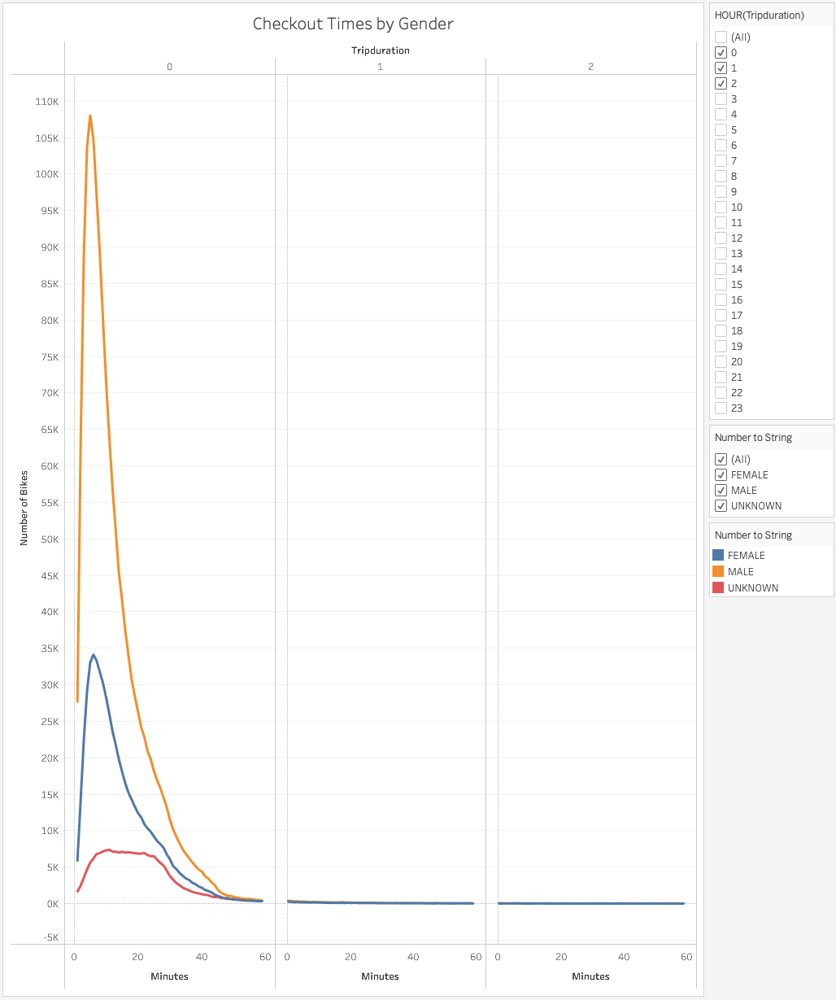
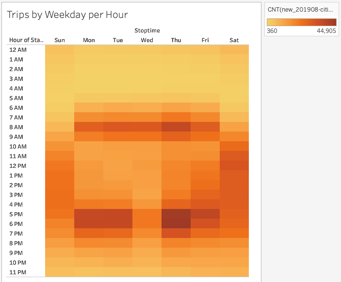
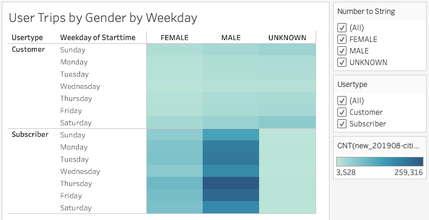

# bikesharing

## Overview of the Statistical Analysis

The purpose of this analysis was to create a solid business proposal using the story feature in Tableau to convince investors that a bike-sharing program in Des Moines is worth their investment.  I first used Python and Pandas functions to convert the "tripduration" column from an integer to a datetime datatype then I exported the DataFrame as a CSV file to use for the trip analysis.  Lastly, using Tableau, I created a variety of insightful visualizations for the investors to reference so that they can make the most educated and appropriate discission of whether they should invest into the bike-sharing program in Des Moines.

## Results

Using Tableau, I created the following seven insightful visualizations for the investors to reference using bake sharing data collected in August 2019 in New York City.

### Gender Breakdown Viz
There was a total of 2,344,224 trips taken with 1,530,272 (~65%) trips taken by males and 588,431 (~25%) trips taken by females.

### August Peak Hours Viz
The highest morning ride volume occurred at 8AM and the highest afternoon ride volume occurred at 5 and 6 PM.  This appears to be related to morning and afternoon work commutes.

### Checkout Times for Users Viz
The most common trip duration is for all riders is about 5 minutes per ride.

### Checkout Times by Gender Viz
The most common trip duration for male riders is about 5 minutes per ride, and for female riders about 6 minutes per ride.

### Trips by Weekday per Hour Viz
During weekdays, most rides occur at 8AM in the morning and 5PM to 6PM in the afternoon. This appears to be related to morning and afternoon work commutes.  During weekends, we see a different story with most rides occurring between 10AM to 6PM.  My recommendation for bike repair would be around 2AM to 4AM because we see our lowest volume of riders during that time window.

### Trips by Gender (Weekday per Hour) Viz
Most users happen to be male but both males and females have the same volume trend.  During weekdays, most rides occur at 8AM in the morning and 5PM to 6PM in the afternoon. This appears to be related to morning and afternoon work commutes.  During weekends, most rides occurring between 10AM to 6PM.  Also, our highest volume of rides seems to occur by males at 5PM to 6PM on Thursdays which is worth investigating further.

.png)

### User Trips by Gender by Weekday Viz
Most users are by far subscribers to CitiBike compared to customers and happen to be mostly male.  Thursdays seem to be our most popular day for both males and females which is worth further investigation.

### Tableau CitiBike Story
To view my CitiBike Story in Tableau, please select the link below.
[link to dashboard](https://public.tableau.com/profile/parker.higgins#!/vizhome/Citibike_Challenge_16179268333720/CitiBikeStory "link to dashboard")

## Summary
In conclusion, most of our users (~65%) happen to be male subscribers to CitiBike.  The average duration of rides are about 5 minutes with females having a slightly longer trip duration per ride then males. Both males and females follow the same trend of most rides occurring at 8AM in the morning and 5PM to 6PM in the afternoon on weekdays. This appears to be related to morning and afternoon work commutes.  During weekends, we see a different story with most rides occurring between 10AM to 6PM. Thursdays between 5PM to 6PM seem to be our most popular day for both males and females which is worth further investigation. Bike repair will be a necessity for the company and I would recommend bike repairs to occur at 2AM to 4AM because we see our lowest volume of riders during that time window.

After reviewing our findings from the CitiBike data, I realized two additional visualizations would be helpful for future analysis.  First, I noticed that the highest volume of rides was occurring on Thursdays by male subscribers.  It would be interesting to see if a specific area within the city was seeing higher volume of rides on Thursdays and if it was related to an event.  Perhaps a sporting or musical event was occurring every Thursday night in August that was driving up the volumes for that day.  My second recommendation is to investigate winter months further to see if we still see to same hourly trends and volumes.  August is probably a very popular time to be outside in New York City but how would those numbers compare to December when commuting to and from work would be more challenging by bike.
